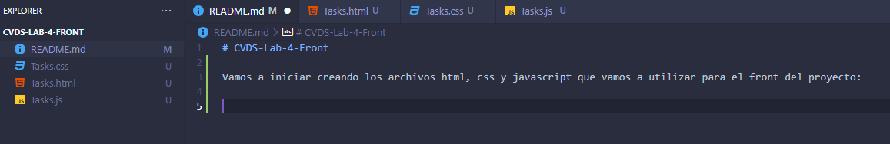
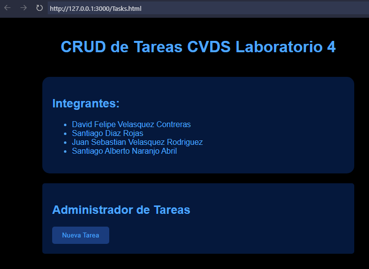

# CVDS-Lab-4-Front

Vamos a iniciar creando los archivos html, css y javascript que vamos a utilizar para el front del proyecto:

Ahora vamos a hacer una entry page para nuestro proyecto, con tal que luego se añada la seccion del CRUD

En primer lugar vamos a realizar un mockup de como necesitamos que luzca nuestra aplicacion:

<!-- Luego de hacer la estructura inicial y aplicar algunos estilos, se ve de esta forma:

 -->
