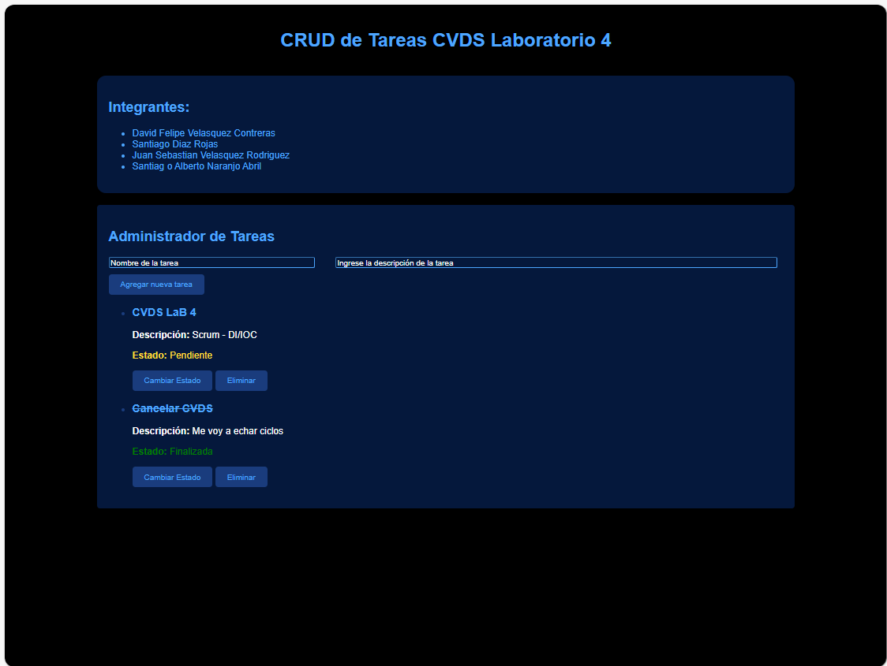

# CVDS LAB 4

## CRUD DE TAREAS FRONTEND

### Integrantes

- Santiago Díaz Rojas
- David Felipe Velásquez
- Sebastián Velásquez
- Santiago Naranjo

## 1. Creacion scaffolding.

Vamos a iniciar creando los archivos html, css y javascript que vamos a utilizar para el front del proyecto:

Ahora vamos a hacer una entry page para nuestro proyecto, con tal que luego se añada la seccion del CRUD

## 2. Creacion de pagina inicial

En primer lugar vamos a realizar un mockup de como necesitamos que luzca nuestra aplicacion:

He aqui el mockup

https://app.moqups.com/4S0JsPhCbW21CO9aDELel8PrS9E8MyfH/view/page/ad64222d5

Luego de hacer la estructura inicial y aplicar algunos estilos, se ve de esta forma:

