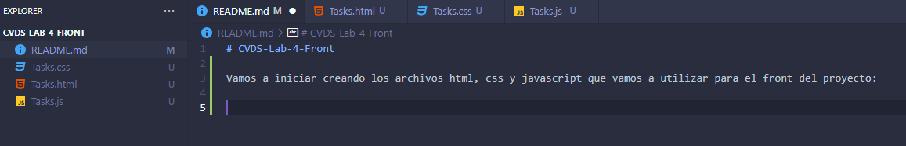
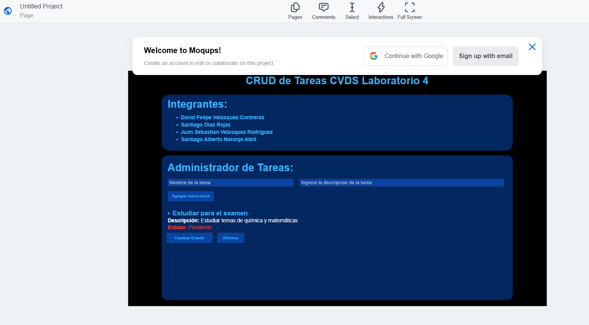
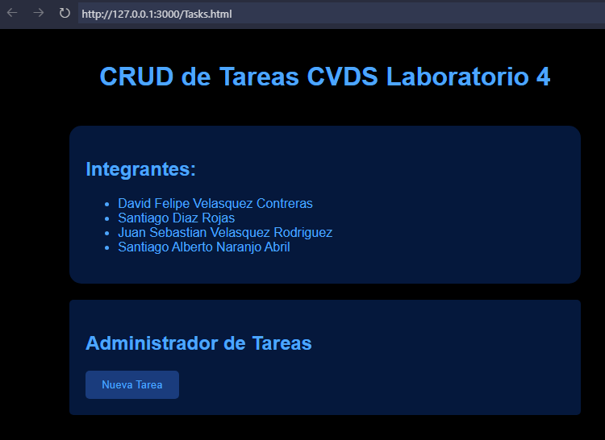
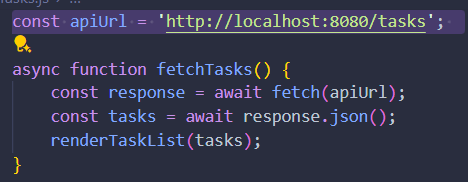
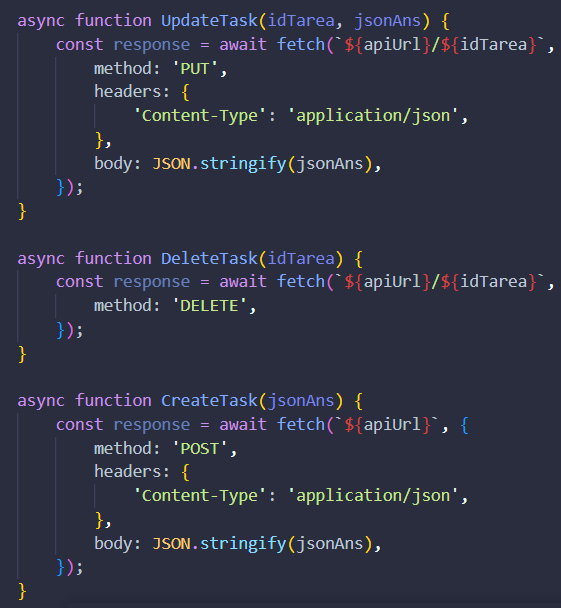
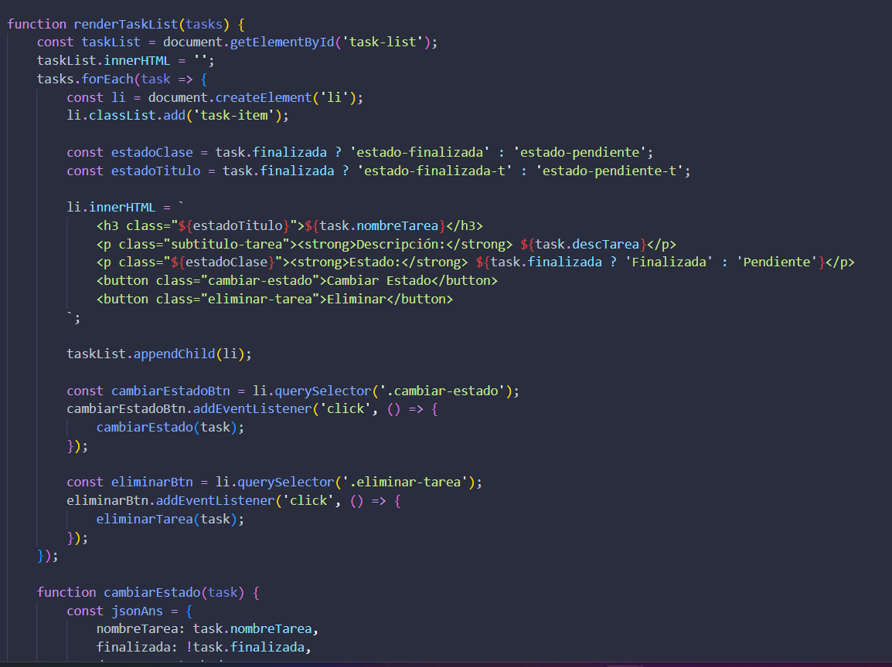
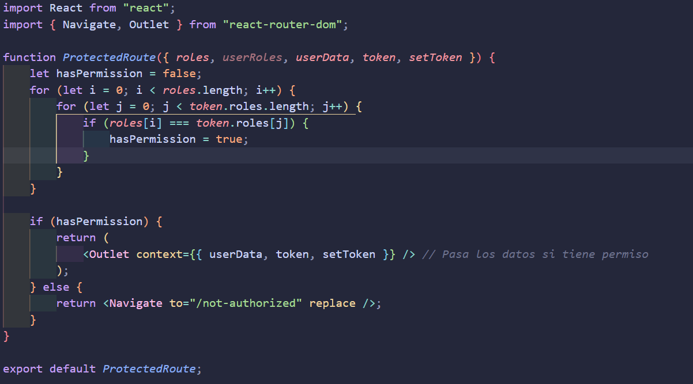
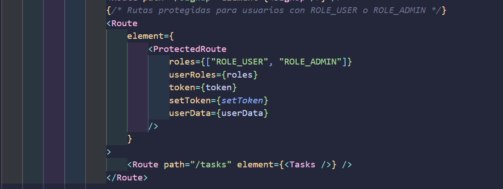
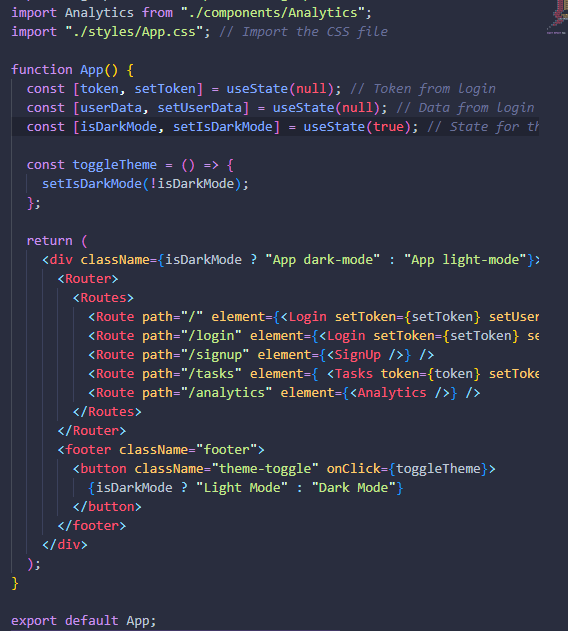

# CVDS LAB 4

## CRUD DE TAREAS FRONTEND

### Integrantes

- Santiago Díaz Rojas
- David Felipe Velásquez
- Sebastián Velásquez
- Santiago Naranjo

## 1. Creacion scaffolding.

Vamos a iniciar creando los archivos html, css y javascript que vamos a utilizar para el front del proyecto:

Ahora vamos a hacer una entry page para nuestro proyecto, con tal que luego se añada la seccion del CRUD

## 2. Creacion de pagina inicial

En primer lugar vamos a realizar un mockup de como necesitamos que luzca nuestra aplicacion:

He aqui el mockup

https://app.moqups.com/4S0JsPhCbW21CO9aDELel8PrS9E8MyfH/view/page/ad64222d5

Luego de hacer la estructura inicial y aplicar algunos estilos, se ve de esta forma:

## 3. Creacion de la logica de conexion con el server

Ya que la url es const apiUrl = 'http://localhost:8080/tasks';

Por lo que debe estar en este puerto y se utiliza en las funciones como parametro, por ejemplo para hacer el fetch:

## 4. Creacion de logica de CRUD

Con estos 3 metodos mas el que creamos deberiamos tener toda la informacion necesaria del back

## 5. Renderizado de tareas en base al back

Se tuvo que hacer un metodo muy complejo con varios elementos pero con ello se tiene la logica que llama a los elementos que ya creamos

Y luego de implementar esta logica utilizamos los render

document.addEventListener('DOMContentLoaded', fetchTasks);
document.addEventListener('DOMContentLoaded', createBtnListener);

Con ello hay elementos en el DOM que escuchan cada vez que cambia el back y con ello se actualiza correctamente

Adicionalmente se cambiaron algunas cosas de estilos y lo necesario en el front para llamarlo con los elementos de listas.

Con ello queda la funcionalidad completa con html, css y js basico

## Laboratorio 5

### Integración continua

Lo unico que se realizo aqui fue configurar el front para que tambien tenga los nuevos elementos de las tareas, con ello creamos los nuevos inputs y añadimos estos elementos a los metodos de task.js

Adicionalmente se realizo con ayuda de Chart.js los graficos interactivos respecto a las tareas, utilizando todos los parametros que nos pedian alli

## Laboratorio 6

### Autenticación

En primer lugar se migro todos los elementos que teniamos a React, se realizo un mockup de como deberia ser la página de login y se crearon los componentes de login, signUp y TaskManager que se encargan de manejar los datos de la autenticación con el back.

De esta manera acoplando todo como componentes en el App.js

Y asi sucesivamente con todo el resto de la logica

Ademas se hicieron cambios para implementar un modo claro y oscuro, y se cambiaron algunas cosas de estilos.

Todo esto sumado a el routing de la página de login y signUp, se puede ver que se pueden crear sesiones de usuarios y se pueden eliminar sesiones de usuarios. Sumado a que si no existen los elementos de los usuarios que se necesitan, se redirige a la página de login.
