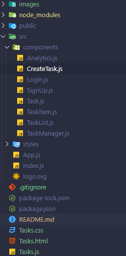

# CVDS LAB 4

## CRUD DE TAREAS FRONTEND

### Integrantes

- Santiago Díaz Rojas
- David Felipe Velásquez
- Sebastián Velásquez
- Santiago Naranjo

## 1. Creacion scaffolding.

Vamos a iniciar creando los archivos html, css y javascript que vamos a utilizar para el front del proyecto:

Ahora vamos a hacer una entry page para nuestro proyecto, con tal que luego se añada la seccion del CRUD

## 2. Creacion de pagina inicial

En primer lugar vamos a realizar un mockup de como necesitamos que luzca nuestra aplicacion:

He aqui el mockup

https://app.moqups.com/4S0JsPhCbW21CO9aDELel8PrS9E8MyfH/view/page/ad64222d5

Luego de hacer la estructura inicial y aplicar algunos estilos, se ve de esta forma:

## 3. Creacion de la logica de conexion con el server

Ya que la url es const apiUrl = 'http://localhost:8080/tasks';

Por lo que debe estar en este puerto y se utiliza en las funciones como parametro, por ejemplo para hacer el fetch:

## 4. Creacion de logica de CRUD

Con estos 3 metodos mas el que creamos deberiamos tener toda la informacion necesaria del back

## 5. Renderizado de tareas en base al back

Se tuvo que hacer un metodo muy complejo con varios elementos pero con ello se tiene la logica que llama a los elementos que ya creamos

Y luego de implementar esta logica utilizamos los render

document.addEventListener('DOMContentLoaded', fetchTasks);
document.addEventListener('DOMContentLoaded', createBtnListener);

Con ello hay elementos en el DOM que escuchan cada vez que cambia el back y con ello se actualiza correctamente

Adicionalmente se cambiaron algunas cosas de estilos y lo necesario en el front para llamarlo con los elementos de listas.

## 6. Implementación mediante roles

Se creo un componente ProtectedRoute el cual se encarga de revisar las 2 listas, una con los roles que pueden ingresar a esta ruta y otra con los roles del usuario que está navegando (en realidad está guardado en el token), si cumple con los roles, lo redirecciona mediante <Outlet>, herramienta que se encarga de por asi decirlo anidar las direcciones, a la ruta que quería ir antes de la revisión y si no cumple con los roles, lo redirecciona al componente NotAuthorized que le mostrará que no está autorizado para ver esto.

Con el fin de proteger las rutas de tasks y analytics, se incorporó ProtectedRoute de la siguiente forma para ambas rutas.
